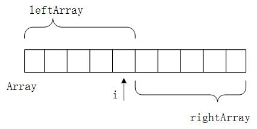

#牛课堂校招笔试面试算法题——第四课（js实现）
### 题目一
>###### 给定一个矩阵matrix，其中的值有正、有负、有0，返回子矩阵的最大累加和。
例如，矩阵matrix为：
```
-90    48    78  
 64   -40    64  
-81    -7    66
```
其中，最大累加和的子矩阵为：
```
  48    78  
 -40    64  
  -7    66
```
所以返回累加和209。
###### 解题思路：
>读题：
###### code：
```
function maxArraySum(arr){
    var cur = 0,
        max = -1000000;
    for(var i = 0;i<arr.length;i++){
        cur += arr[i];
        max = max>cur?max:cur;
        cur = cur>0?cur:0;
    }
    return max;
}
function maxMatrixSum(arr){
    var cur = 0,
        max = -1000000;
    var len = arr[0].length;
    var newArr = Array.apply(null, Array(len)).map(function(item, i) {
        return 0;
    });
    for (var i = 0;i<arr.length;i++){
        for (var j = i;j<arr.length;j++){
            for (var k = 0;k<len;k++){
                newArr[k] += arr[j][k];
            }
            max = max>maxArraySum(newArr)?max:maxArraySum(newArr);
        }
        newArr = Array.apply(null, Array(len)).map(function(item, i) {
            return 0;
        });
    }
    return max;
}
maxMatrixSum([[-90,48,78],[64,-40,64],[-81,-7,66]]);

```
### 题目二
>###### 给定一个数组，每个位置的值代表一个高度。那么整个数组可以看成是一个直方图。如果把这个直方图当作容器的话，求这个容器能装多少水。
例如：
```
[3,1,2,4]
```
代表第一个位置高度为3，第二个位置高度为1，第三个位置高度为2，第四个位置高度为4。所以[3,1,2,4]这个数组代表的容器可以装3格的水。
###### 解题思路：
>读题：
###### code：
```
function waterProblem (arr){
    var left = 0,
        right =arr.length-1,
        max = 0,
        i = 0,
        j = arr.length-1;
        
        while (i != j){
            if (arr[left]<=arr[right]){
                if(arr[left]<arr[i]){
                    i++;
                    left++;
                }else{
                    max += arr[left]-arr[i];
                    i++;
                }
            }else{
                if(arr[right]<arr[j]){
                    j--;
                    right--;
                }else{
                    max += arr[right]-arr[j];
                    j--;
                }
            }
        }
        return max;
}
waterProblem ([3,1,2,4]);
```
### 题目三
>###### 给定一个数组，长度大于2。找出不相交的两个数组，情况是很多的。请返回这么多情况中，两个不相交子数组最大的和。
例如：
```
[-1,3,4,-9,1,2]
```
当两个不相交子数组为[3,4]和[1,2]时可以得到最大的和为10。
###### 解题思路：
>读题：不相交的两个数组即从原数组中间任意位置隔开（不取最后一位）分别取左右数组的子数组。即求 i (i>=0&&i<array.length-1)在某个位置上（左数组最大连续累加和）与（右数组最大连续累加和）之和最大。//i位置上隔开左数组包括i位置，右数组不包括。

###### code：
```
function twoSubArrayMaxSum(arr){
    var cur = 0,
        max = -1000000,
        maxSum = -100000,
        leftArr = [],
        rightArr = [];
    for (var j = arr.length-1;j>=0;j--){
        cur += arr[j];
        max = max>cur?max:cur;
        cur = cur>0?cur:0;
        rightArr[j] = max;
    } 
    max = -1000000;
    cur = 0;
    for (var i = 0;i<arr.length-1;i++){
        cur += arr[i];
        max = max>cur?max:cur;
        cur = cur>0?cur:0;
        maxSum = maxSum>max+rightArr[i+1]?maxSum:max+rightArr[i+1];
    }
    return maxSum;
}
twoSubArrayMaxSum([-1,3,4,-9,1,2]);
```
### 题目四
>###### 给定一个长度为N（N>1）的整形数组arr，可以划分成左右两个部分，左部分为arr[0..K]，右部分为arr[K+1..N-1]，K可以取值的范围是[0，N-2]。求这么多划分方案中，左部分中的最大值减去右部分最大值的绝对值中，最大是多少？
例如：
```
[2,7,3,1,1]
```
当左部为[2,7,3]，右部为[1,1]时，左部分中的最大值减去右部分最大值的绝对值最大为6。最终返回6。
###### 解题思路：
>读题：左部分中的最大值减去右部分最大值的绝对值最大，意味着左部分中的最大值减去右部分最大值的值最大或者右部分中的最大值减去左部分最大值的值最大。即可理解为左右数组最大值之差最大。
将数组划分成左右两部分，原数组array中最大值MAX必定存在并且可以随意划分在左数组或右数组中且为所在部分数组最大值。结果必定为（MAX-左数组最大值）或者（MAX-右数组最大值），此时就转为求解存在最小的（左数组最大值）或最小的（右数组最大值），由于MAX可以随意划分到左数组或右数组，并且左数组必定包含左边界array[0]，右数组必定包含右边界array[array.length-1]即（左数组最大值）>=array[0]，（右数组最大值）>=array[array.length-1] 。所以只要求得min（array[0]，array[array.length-1]）即可得到答案。结果为MAX-min（array[0]，array[array.length-1]）。（min求两者较小值，相等时随意取）。
###### code：
```
function maxABSBetweenLeftAndRight(arr){
    var max = -1000000;
    for (var i = 0;i < arr.length;i ++){
        max = max>arr[i]?max:arr[i];
    }
    return max = (max-arr[0]>max-arr[arr.length-1])?max-arr[0]:max-arr[arr.length-1];
}
 maxABSBetweenLeftAndRight([2,7,3,1,1]);
```
>##### 已上解题思路均来自左神喷火龙讲解~~  js代码原创